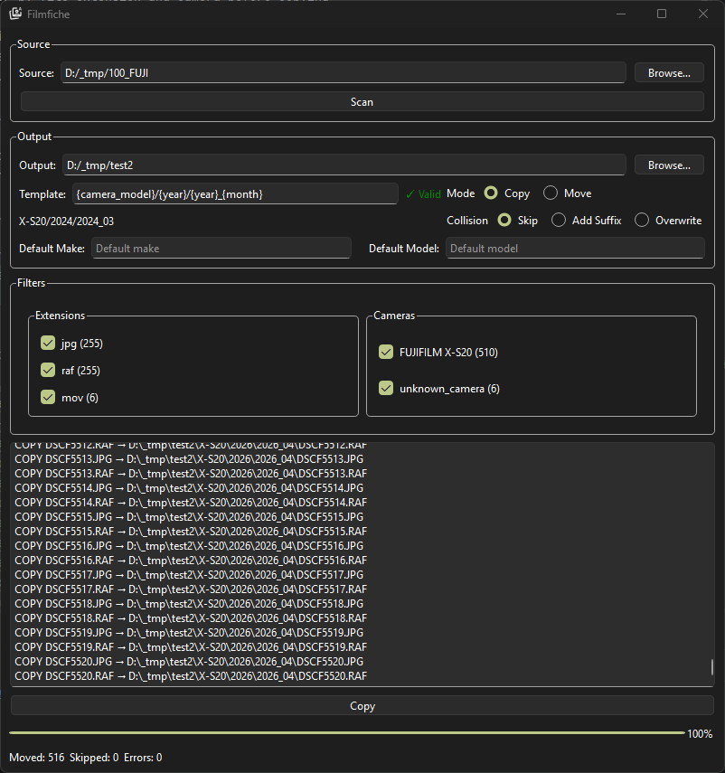
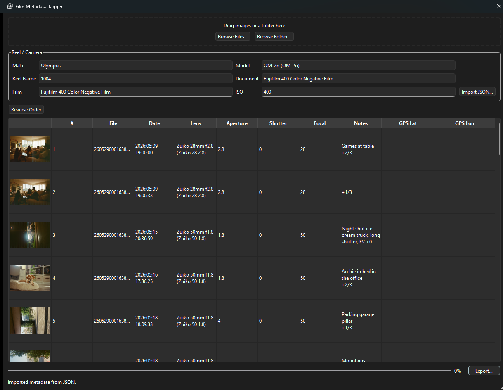

# Filmfiche

A simple desktop app for organizing photos and videos by date and camera metadata. Filmfiche scans a source folder, reads EXIF and video container metadata, and copies or moves files into a structured output directory based on a user-defined template.



## Features
- Recursive scan of source directories for photos and videos
- Metadata extraction from JPEG, PNG, HEIC, RAF (Fujifilm), and MOV/MP4 files
- Camera info sourced from EXIF Make/Model or video container device metadata
- Template-based output paths using tokens
- Live template preview and validation in the UI
- Filter by file extension and camera before copying
- Copy or Move mode
- Collision handling: Skip, Add Suffix, or Overwrite
- Files without a usable date use the modified date (but warn the user on scan and copy)
- Default Make / Default Model fallbacks for files with no camera metadata
- **Film Metadata Tagger** (Tools menu): drag/drop or browse scans, set camera
  make/model globally and edit lens/exposure/etc per frame (or import a
  Lightme/Logbook JSON), then export tagged, renamed copies

## Tested Devices / Formats
- iPhone (jpg, mov, dng)
- Fujifilm Mirrorless (jpg, mov, raf)

If you find a format that doesn't work, feel free to open an issue and provide a sample file.

## Film Metadata Tagger

Open it from **Tools → Film Metadata Tagger…**. Drag in a folder of scans (or
browse for one), and the frames appear with thumbnails, numbered 1..N by filename
ascending. Set the camera make/model once for the whole reel, then edit lens,
aperture, shutter, focal length, notes, and GPS per frame — or **Import JSON…** to
pull everything in from a Lightme/Logbook export (entries pair to images by order).
If your scans run the opposite direction to the metadata, hit **Reverse Order** to
flip the sequence before importing. Hit **Export…** to pick a destination; each
frame is written as `{ReelName}-{ImageNumber:04d}` inside a
`{ReelName}-{DocumentName}` subfolder with the metadata embedded as EXIF. JPEGs are
copied byte-for-byte (pixels untouched); TIFFs are round-tripped preserving
compression.



## Half Frame Splitter

Open it from **Tools → Half Frame Splitter…**. Half-frame cameras record two
portrait photos in a single 35mm frame, so a scan is one landscape image with two
photos side by side. Point the tool at a folder of these scans and an output
folder, and it finds the film gap between the two photos, splits them, crops each
to 3:4, and writes them out keeping the original name with `-a` (left) and `-b`
(right) appended. Detection is automatic (it locates the low-detail seam band); if
a scan is off, switch to **Center** split or adjust the search window and re-run.

## Future Goals
- Test on more devices
- Add file format conversion (e.g. HEIC to JPEG)
- Add support for more metadata (e.g. Lens, GPS, Content, etc.)
- Test on more devices
- Add file format conversion (e.g. HEIC to JPEG)
- Add support for more metadata (e.g. Lens, GPS, Content, etc.)

## Requirements

- Python 3.14+
- Dependencies: `PySide6 exifread Pillow pillow-heif hachoir piexif numpy`

## Setup

### Using uv (recommended)

[uv](https://docs.astral.sh/uv/) reads `pyproject.toml` and `uv.lock` to build a
virtual environment with pinned dependencies:

```bash
uv sync          # create .venv and install all dependencies (incl. test deps)
uv run main.py   # launch the app
```

### Using pip

```bash
pip install PySide6 exifread Pillow pillow-heif hachoir piexif numpy
python main.py
```

## Template Tokens

| Token | Example |
|---|---|
| `{year}` | `2024` |
| `{month}` | `03` |
| `{day}` | `07` |
| `{month_name}` | `March` |
| `{camera}` | `FUJIFILM_X-S20` |
| `{camera_make}` | `FUJIFILM` |
| `{camera_model}` | `X-S20` |
| `{ext}` | `jpg` |

Example: `{camera_model}/{year}/{month}` → `X-S20/2024/03/`

## Running Tests

```bash
uv run pytest     # with uv
python -m pytest  # with pip
```
